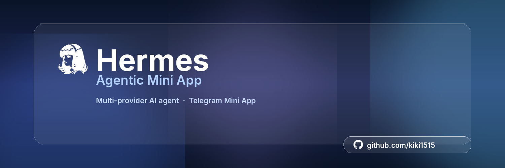
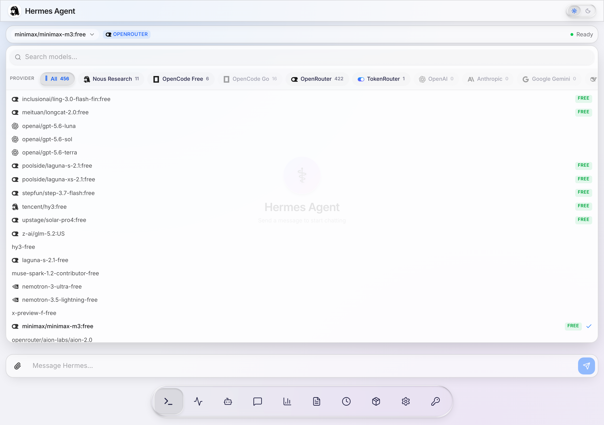
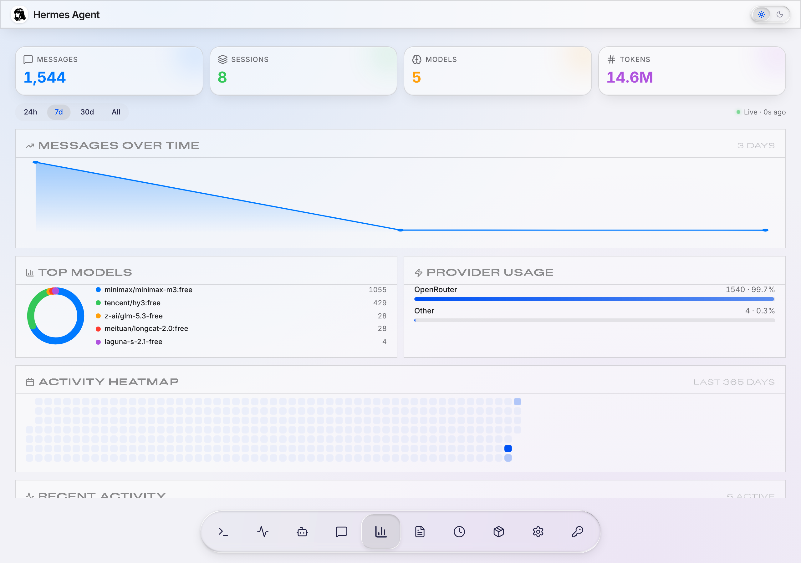
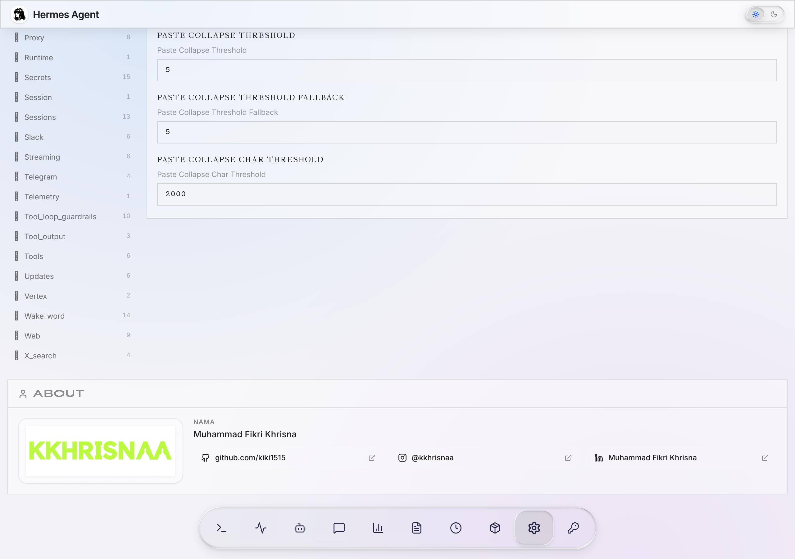

<p align="center">
  
</p>

<p align="center">
  <strong>Multi-provider AI agent dashboard with iOS 26 liquid glass UI for Telegram Mini Apps</strong>
</p>

<p align="center">
  <a href="https://github.com/kiki1515/hermes-agentic-miniapp/blob/main/LICENSE"></a>
  <a href="https://github.com/kiki1515/hermes-agentic-miniapp/stargazers"></a>
  <a href="https://github.com/kiki1515/hermes-agentic-miniapp/network/members"></a>
  
</p>

---

## ✨ Features

- 🎨 **iOS 26 Liquid Glass UI** — Glassmorphic components with `feDisplacementMap` SVG shaders, `color-mix()` themed highlights, and macOS Tahoe–style frosted switchers
- 🤖 **Multi-Provider AI** — Unified chat interface across **Nous Research**, **OpenRouter**, **TokenRouter**, and **OpenCode** with a single API
- 📊 **Real-Time Analytics** — Live dashboard with line/area charts, donut distribution, provider breakdown, 365-day activity heatmap, and token tracking (3s polling)
- 📎 **Rich File Upload** — Drag & drop image, audio, video, PDF, code, and archives with type-aware previews
- 💬 **Session Resume** — Persistent session history, search across messages, and one-click "Lanjutkan" (continue) flow
- 🎛️ **Live Environment Editor** — Configure API keys and base URLs for every provider with built-in official defaults
- 🌗 **Theme Switcher** — Liquid-glass Sun/Moon toggle between light and dark modes
- 🔍 **Provider Filter** — Single-select per provider with a smart "All" chip that aggregates every enabled source
- 📱 **Mobile-First Responsive** — Bottom dock adapts from 280px (mobile) to 600px (desktop) with breakpoint-driven layout

---

## 🖼️ Screenshots

### 💬 Chat
<p align="center">
  
</p>

### 📊 Analytics
<p align="center">
  
</p>

### ⚙️ Config — About
<p align="center">
  
</p>

---

## 🏗️ Architecture

```
┌─────────────────────────────────────────────────┐
│  Telegram Mini App (Telegram WebApp)            │
│  ┌───────────────────────────────────────────┐  │
│  │  React 19 + TypeScript + Vite            │  │
│  │  Tailwind CSS · Liquid Glass (custom)    │  │
│  │  shadcn/ui components                     │  │
│  └───────────────────────────────────────────┘  │
└────────────────┬────────────────────────────────┘
                 │ HTTPS / REST
                 ▼
┌─────────────────────────────────────────────────┐
│  Hermes Web Server (FastAPI/Starlette · Python) │
│  ┌───────────────────────────────────────────┐  │
│  │  Provider routing (Nous/OR/TR/OC)         │  │
│  │  Auth middleware (session token + TG)     │  │
│  │  Session DB (SQLite)                      │  │
│  │  Analytics aggregator                     │  │
│  │  CORS · Cloudflare Tunnel                 │  │
│  └───────────────────────────────────────────┘  │
└────────────────┬────────────────────────────────┘
                 │ OpenAI-compatible API
                 ▼
  ┌──────────┬─────────────┬─────────────┬────────────┐
  │  Nous    │  OpenRouter  │  TokenRouter│  OpenCode  │
  │  Portal  │  396+ models │  300+ models│  Free/Go   │
  └──────────┴─────────────┴─────────────┴────────────┘
```

---

## 🛠️ Tech Stack

**Frontend**
- React 19 + TypeScript
- Vite 7
- Tailwind CSS 4 (`@theme` directive)
- shadcn/ui primitives
- Lucide React (icons)
- Custom SVG (no chart library — line/donut/heatmap all hand-rolled)

**Backend**
- Python 3.11
- FastAPI / Starlette (`hermes_cli.web_server`)
- SQLite (`hermes_state.SessionDB`)
- Uvicorn (ASGI server)
- Cloudflare Tunnel (free, persistent URL)

**Integrations**
- Telegram Bot API
- OpenAI-compatible LLM providers
- Model Context Protocol (MCP) — provider plugin architecture

---

## 🚀 Quick Start

### Prerequisites

- Node.js 20+ and npm
- Python 3.11+
- A Telegram bot token (create via [@BotFather](https://t.me/BotFather))
- At least one LLM provider API key (Nous, OpenRouter, TokenRouter, or OpenCode)

### 1. Clone

```bash
git clone https://github.com/kiki1515/hermes-agentic-miniapp.git
cd hermes-agentic-miniapp
```

### 2. Backend

```bash
cd hermes_cli
python3 -m venv venv
source venv/bin/activate
pip install -r requirements.txt
export TELEGRAM_BOT_TOKEN="<your-bot-token>"
export API_SERVER_KEY="<generate-a-random-32-char-string>"
export NOUS_API_KEY="<optional>"
export OPENROUTER_API_KEY="<optional>"
export TOKENROUTER_API_KEY="<optional>"
python -B -c "from hermes_cli.web_server import start_server; start_server('127.0.0.1', 9119, False)"
```

### 3. Frontend

```bash
cd web
npm install
npm run build
# dist/ is what the backend serves from hermes_cli/web_dist/
```

### 4. Tunnel (for Telegram)

```bash
cloudflared tunnel --url http://localhost:9119
# Copy the *.trycloudflare.com URL
curl -X POST "https://api.telegram.org/bot<TOKEN>/setChatMenuButton" \
  -H "Content-Type: application/json" \
  -d '{"chat_id":"<your-telegram-id>","menu_button":{"type":"web_app","text":"Hermes","web_app":{"url":"<your-tunnel-url>"}}}'
```

Open Telegram, tap the **Hermes** menu button — your mini app is live.

---

## 🎨 Customization

### Brand identity
Edit `web/src/pages/ConfigPage.tsx` (the `About` section near the bottom) to put your own name and social links.

### Theme
Toggle via the Sun/Moon switcher in the top-right of the mini app. All tokens are CSS variables — easy to re-theme by editing `web/src/index.css` and the `:root[data-theme="..."]` blocks.

### Provider icons
Drop a `your-provider.svg` (24×24 viewBox, monochrome) into `web/public/assets/providers/`, then register it in `web/src/pages/ChatPage.tsx` via `MODEL_LOGO_MAP`.

---

## 🤝 Contributing

PRs welcome! This project ships a **lot** — bug fixes, new providers, mobile tweaks, design polish are all in scope.

For substantial changes, please open an issue first to discuss the approach. The narrow waist is the **core agent + the model tool schema** — anything sent on every API call. Everything else (UI, providers, integrations) is fair game.

---

## 🪪 License

This project is licensed under the **MIT License** — see [LICENSE](LICENSE) for full text.

```
MIT License

Copyright (c) 2026 Muhammad Fikri Khrisna

Permission is hereby granted, free of charge, to any person obtaining a copy
of this software and associated documentation files (the "Software"), to deal
in the Software without restriction, including without limitation the rights
to use, copy, modify, merge, publish, distribute, sublicense, and/or sell
copies of the Software, and to permit persons to whom the Software is
furnished to do so, subject to the following conditions:

The above copyright notice and this permission notice shall be included in all
copies or substantial portions of the Software.

THE SOFTWARE IS PROVIDED "AS IS", WITHOUT WARRANTY OF ANY KIND, EXPRESS OR
IMPLIED, INCLUDING BUT NOT LIMITED TO THE WARRANTIES OF MERCHANTABILITY,
FITNESS FOR A PARTICULAR PURPOSE AND NONINFRINGEMENT. IN NO EVENT SHALL THE
AUTHORS OR COPYRIGHT HOLDERS BE LIABLE FOR ANY CLAIM, DAMAGES OR OTHER
LIABILITY, WHETHER IN AN ACTION OF CONTRACT, TORT OR OTHERWISE, ARISING FROM,
OUT OF OR IN CONNECTION WITH THE SOFTWARE OR THE USE OR OTHER DEALINGS IN THE
SOFTWARE.
```

---

## 🙏 Credits

Built on top of [clawvader-tech/hermes-telegram-miniapp](https://github.com/clawvader-tech/hermes-telegram-miniapp) (MIT) — the original Telegram Mini App shell for the [Hermes Agent](https://github.com/hermes-agent) project by Nous Research.

UI design heavily inspired by:
- [Vadim Matveev — Liquid Glass Switcher (KwpRaGr)](https://codepen.io/fooontic/pen/KwpRaGr)
- Apple iOS 26 / macOS Tahoe liquid glass system

---

## 👤 Author

**Muhammad Fikri Khrisna**
- GitHub: [@kiki1515](https://github.com/kiki1515)
- Instagram: [@kkhrisnaa](https://instagram.com/kkhrisnaa)
- LinkedIn: [Muhammad Fikri Khrisna](https://www.linkedin.com/in/muhammad-fikri-khrisna-b756a51b3/)

---

<p align="center">
  <sub>Built with 🔮 by Muhammad Fikri Khrisna · 2026</sub>
</p>
